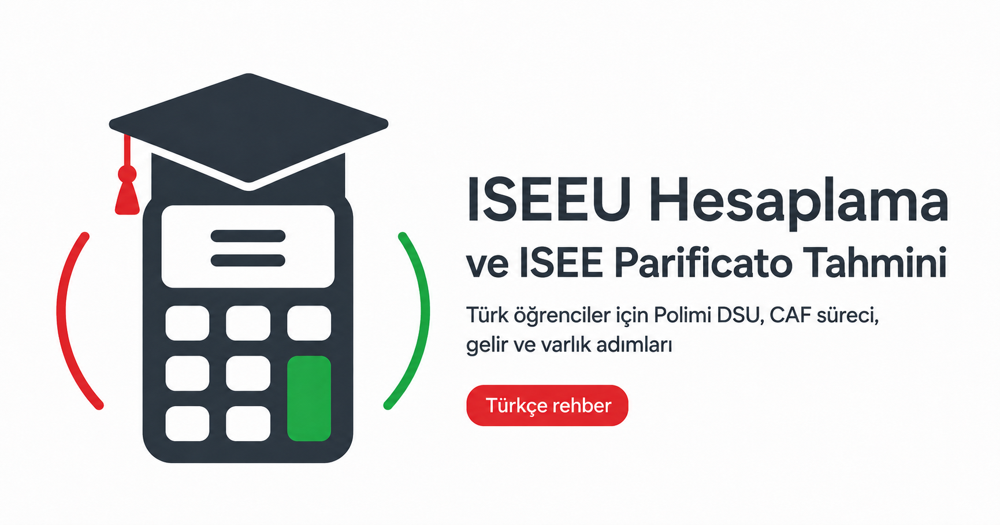

<p align="center">
  
</p>

# ISEEU Hesaplama

Polimi DSU ve üniversite bursları için adım adım, **tahmini** ISEEU Parificato hesaplayıcısı.
<br />
<br />
A step-by-step **estimate** calculator for the ISEEU Parificato indicator used by Polimi DSU and university scholarships.

<p align="center">
  <a href="https://github.com/EgeOnder/calciseeu/actions/workflows/ci.yml"></a>
  <a href="./LICENSE"></a>
  
</p>

> Bu araç yalnızca **tahmini** bir sonuç üretir ve resmî CAF hesaplamasının yerine **geçmez**. Geçerli ISEEU/ISPEU değerini üniversitenin onaylı CAF merkezi hesaplar.
>
> This tool produces an **estimate only** and is **not** a substitute for the official CAF calculation.

## Getting started

Requires [Bun](https://bun.sh).

```bash
bun install      # install dependencies
bun run dev      # start the dev server (http://localhost:5173)
```

| Script            | Description                          |
| ----------------- | ------------------------------------ |
| `bun run dev`     | Start the Vite dev server            |
| `bun run build`   | Type-check (`tsc -b`) and build      |
| `bun run preview` | Preview the production build locally |
| `bun run lint`    | Lint with oxlint                     |

## How the estimate works

All amounts are entered in a local currency and converted to EUR. The engine ([`src/lib/iseeu.ts`](src/lib/iseeu.ts)) computes:

```
ISE   = ISR + 0.20 × ISP
ISEEU = ISE ÷ equivalence coefficient
ISPEU = ISP ÷ equivalence coefficient
```

The logic follows the public ISEEU Parificato guidance (income deductions, asset franchises, the 500 €/m² building convention, main-residence threshold and the household equivalence scale). It is a simplification for estimation purposes — see the disclaimer above.

## Contributing

Contributions are welcome! Please read [CONTRIBUTING.md](CONTRIBUTING.md) first.

## Funding

If this project helps you, consider [sponsoring the maintainer](https://github.com/sponsors/EgeOnder).
